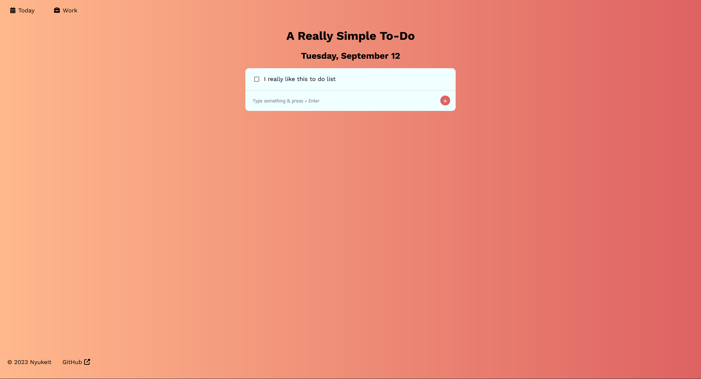

# ToDoEx - A To Do App (WIP)

This is a very simple To Do List app based on Node.js and Express.js using the EJS templating engine. This is not meant to be a fully functional to-do app. It is not connected to a database and hence does not save any data.

## How to Use
Just type whatever you want to add as a To Do and press 'Enter' or click on the '+' button. There is a separate list for Work to-dos.

